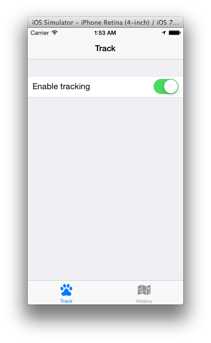
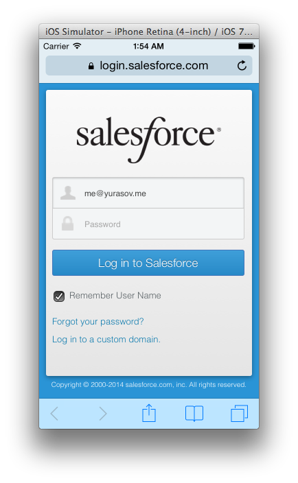
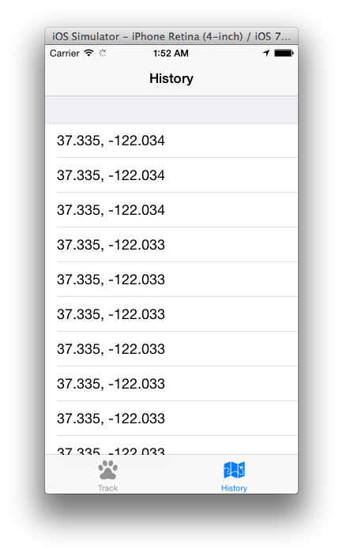

# Utilizing Salesforce REST APIs with Appcelerator Titanium

Appcelerator Titanium is increasingly popular tool for developing cross-platform mobile applications especially for enterprise use. In this tutorial we're going to track and display our location history with the use of Salesforce REST API.

REST APIs are accessible form any environment that can send an HTTP request. In many ways it's the most flexible way to communicate to Salesforce platform and gives you the ability to fully control your data flow.

In this tutorial we're going to build a Titanium app which lets you track and view your location history using Salesforce REST API.

Source code of the sample app can be found here: [https://github.com/myurasov/Salesforce-REST-API-Titanium-Sample](https://github.com/myurasov/Salesforce-REST-API-Titanium-Sample). You can import it to Titanium Studio via _File > Import > Existing mobile project_.

You will also need Ti.Map module installed. Download it from [https://marketplace.appcelerator.com/apps/5005](https://marketplace.appcelerator.com/apps/5005) and install using Titanium Studio menu _Help > Install Mobile Module_.
>
* Creating Salesforce Connected App
* Adding custom SObject
* Understanding authentication flow with OAuth2
* Creating new "Position" object
* Logging position to the server
* Retrieving position history from the server and displaying it

## Creating Salesforce Connected App

Let's create a Connected app on Force.com:

- Go to [https://developer.salesforce.com/](https://developer.salesforce.com/), sign up and navigate to your developer account.
- In the side menu choose Create > Apps and create new Connected App.
- Name it "SF Sample 1", enter your email and check "Enable OAuth Settings"
- Enter `sfsampleapp://oaut-callback` as your Callback URL.
- Add "Full access" to Selected OAuth Scopes
- Save Connected App


Now you can see the _client id_ of your Connected App at _Create > Apps > SF Sample 1 > Manage_. Edit your __tiapp.xml__ file and replace `--your-app-client-id--` with it.

## Adding custom SObject

We're going to use a custom object for storing location data in the Salesforce cloud. So we need to create one:

- Select _Create > Objects_ in the side menu
- Click "New Custom Object" button
- Enter "Position" as object label, "Positions" as plural label. "Position__c" will be automatically assigned as an API name for our object. We'll use this name for call to REST API.
- Leave other setting to default and hit Save

## Understanding authentication flow with OAuth2

Our application uses OAuth2 protocol supported by Salesforce to obtain a special string which serves as a permission to access server-side data – __access token__.

First phase of the authentication flow begins when a developer registers his application with OAuth server. We have already done this step when we have created a Connected App on Force.com. During this step you also register a _callback url_ which is handled by your app in the final stage of the process. After registering your app you get the _client id_ – the unique string which identifies your application with OAuth server.

When user of your application tries to access a resource that is secured by _auth token_ your app forms an url of a login page that contains _client id_ and _scope_ (list of requested permissions) as parameters and opens this url in a web browser.

In our case this url looks like this:

```
https://login.salesforce.com/services/oauth2/authorize
	?response_type=token
	&display=touch
	&redirect_uri=sfsampleapp://oauth-callback
	&client_id=<client_id>
```

If user has an account with the auth server he enters his login/password, otherwise creates an account and then proceeds. After user authentication server asks if the user authorizes our application for a certain actions (determined by _scope_ parameter) and if so – redirects to the _callback url_.

The callback url contains all the information application needs to access protected resources – _auth token_, API endpoint, etc:

```
sfsampleapp://oauth-callback
#access_token=<token>
&instance_url=https%3A%2F%2Fna15.salesforce.com
&id=https%3A%2F%2Flogin.salesforce.com%2Fid%2F00Di0000000i7UjEAI%2F005i0000002Cy97AAC
&issued_at=1398573122814&signature=NDlJ9Gnz1of90yb1%2BvIgwPtl%2FQqEU31bJZ392LZeWf3D
&scope=full
&token_type=Bearer
```

Meaning of some of the params:

- __access_token__ – temporary token that serves for authorizing access to Salesforce APIs
- __instance_url__ – API endpoint that should be used by our application
- __issued_at__ – Unix timestamp of the token creation date

You may have noticed we're using custom URL scheme for the callback. Our app is registered in the system as the one that opens this type of URLs so we get a callback when user is done with the login process on the Salesforce web site. This is achieved by adding the following lines our app __tiapp.xml__ file[^1]:

```xml
<ios>
  <plist>
    <dict>
	    ...
		<key>CFBundleURLTypes</key>
		<array>
		  <dict>
		    <key>CFBundleURLName</key>
		    <string>me.yurasov.sfsampleapp</string>
		    <key>CFBundleURLSchemes</key>
		    <array>
		      <string>Sfsampleapp</string>
		    </array>
		  </dict>
		</array>
		...
    </dict>
  </plist>
</ios>
```

When the auth server redirects browser to `sfsampleapp://..` url our app is called with url accessible through `Ti.App.getArguments().url` variable. We read this url and parse it's parts into an object which is stored via `Ti.App.Properties.setObject()` call in `Auth` service.

Now let's see what's happening when the user presses "Enable tracking" switch:



## Creating new "Position" object

When location tracking is requested the first thing app checks is whether we have access token:

```js
...
if (e.value) {

  if (!Auth.get()) {
    // no authorization
    switchEnableTracking.value = 0;
    Auth.openLogin();
  } else {
    createPositionObject();
  }

} else {
  stopGeolocation();
}
...
```

If there is no valid authentication data the user is directed to Salesforce login page:



Otherwise it proceeds to `createPositionObject()` which calls __POST__ HTTP method on a _Positions_ collection to create a new resource in it. The response contains newly created object id which is then saved to `Ti.App.positionObjectId`:

```js
// create position resource
function createPositionObject() {
  
  var authData = Auth.get();  

  var xhr = Ti.Network.createHTTPClient();

  xhr.onload = function (e) {
    // start geolocation
    Ti.App.positionObjectId = JSON.parse(e.source.responseText).id;
    startGeolocation();
  };

  xhr.onerror = function (e) {
    if (e.source.status === 401 /* unauthorized */) {
      switchEnableTracking.value = 0;
      Auth.openLogin();
    }
  };

  xhr.open('POST', authData.instance_url + '/services/data/v29.0/sobjects/Position__c');
  xhr.setRequestHeader('Authorization', authData.token_type + ' ' + authData.access_token);
  xhr.setRequestHeader('Content-type', 'application/json');
  xhr.send(JSON.stringify({'Data__c': ''}));
}
```

In case our token is no longer valid we get `HTTP 401 Unauthorized` response and open login page one more time to get a fresh token.

## Logging position to the server

When we get a location update we want to save to the server. This is achieved by calling __PATCH__ HTTP method on our _Position_ resource:

```js
function onLocation(e) {

  // get coordinates
  var lat = e.coords.latitude;
  var lon = e.coords.longitude;

  positionList.unshift([lat, lon]);

  // store only 25 recent positions
  if (positionList.length > 25) {
    positionList.splice(-1);
  }
  
  // save data

  var authData = Auth.get();

  var xhr = Ti.Network.createHTTPClient();

  xhr.open('PATCH', authData.instance_url + '/services/data/v29.0/sobjects/Position__c/' + Ti.App.positionObjectId);
  xhr.setRequestHeader('Authorization', authData.token_type + ' ' + authData.access_token);
  xhr.setRequestHeader('Content-type', 'application/json');
  xhr.send(JSON.stringify({'Data__c': JSON.stringify(positionList)}));
}
```

## Retrieving position history from the server and displaying it

Finally to get our data from the server we call __GET__ HTTP method on a _Position_ resource:

```js
function update() {
  if (Ti.App.positionObjectId) {

    var authData = Auth.get();

    var xhr = Ti.Network.createHTTPClient();

    xhr.onload = function (e) {
      ... display route on a map ...    
    }

    // get position list
    xhr.open('GET', authData.instance_url + '/services/data/v29.0/sobjects/Position__c/' + Ti.App.positionObjectId);
    xhr.setRequestHeader('Authorization', authData.token_type + ' ' + authData.access_token);
    xhr.setRequestHeader('Content-type', 'application/json');
    xhr.send();
  }
}
```

When the data is loaded we display the route on a map:



## Conclusion

Using Salesforce REST APIs along with OAuth authentication is flexible and can be easily applied to pretty much any platform/environment, making Salesforce a truly cross-platform solution.

## About the Author

Mikhail Yurasov is a full-stack _mobile/web/connected devices_ developer specializing in bringing projects from the idea to full implementation. Feel free to contact him at <me@yurasov.me> for any comments and questions or visit his:

- [LinkedIn](https://www.linkedin.com/profile/view?id=173007295)
- [GitHub](https://github.com/myurasov)

Thank you for reading!


[^1]: For the purpose of this tutorial we're supporting iOS only. For information how to handle custom urls on Android see [https://gist.github.com/dawsontoth/840600](https://gist.github.com/dawsontoth/840600).
